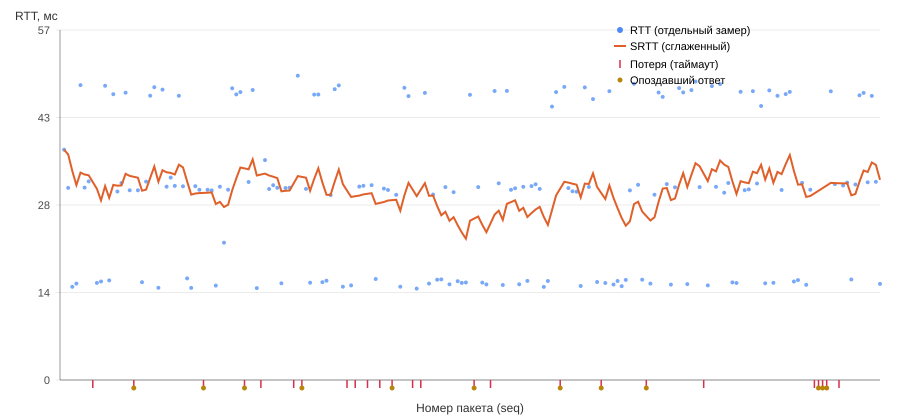
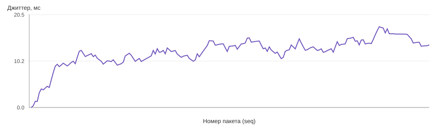

# Отчёт по измерению задержки UDP-протокола

Конфигурация эксперимента: см. [Experiment_Config.md](Experiment_Config.md). Сырые данные: [latency_samples.csv](latency_samples.csv) (223 строки).

## Сводная статистика по прогону

| Метрика | Значение |
|---|---|
| Отправлено PING | 200 |
| Получено вовремя (OnTime) | 175 |
| Потеряно (не ответили до таймаута 150 мс) | 25 |
| — из них пришли позже как Late | 12 |
| Дублированные PONG | 10 |
| Неизвестные (ответ на несуществующий seq) | 0 |
| **Доля потерь** | **12.50 %** |
| **SRTT на конец прогона** | **32.48 мс** |
| **Джиттер на конец прогона** | **13.80 мс** |
| RTT: мин / медиана / среднее / p95 / макс | 14.8 / 31.2 / 30.7 / 47.6 / 49.4 мс |

## RTT и сглаженный RTT по ходу эксперимента

Синие точки — RTT отдельных PONG (только успешные, статус OnTime); оранжевая линия — SRTT (RFC 6298, α=1/8, β=1/4); красные засечки внизу — потерянные по таймауту запросы; жёлтые точки внизу — эти же запросы, когда PONG всё-таки пришёл позже (Late).

**Наблюдение:** RTT-точки заметно группируются в три полосы — около 15, 31 и 47 мс — вместо равномерного распределения, которое даёт `Random.Next(5, 40)` на сервере. Это артефакт разрешения системного таймера Windows по умолчанию (~15.6 мс): `Task.Delay` округляет фактическую задержку вверх до ближайшего системного тика, поэтому непрерывный диапазон 5–40 мс схлопывается в 1–3 тика. На реальной сети (или при включении высокоточных таймеров) распределение было бы непрерывным. Для целей практики это не мешает: SRTT/джиттер считаются корректно независимо от формы распределения источника.

## Джиттер по ходу эксперимента

Джиттер (RFC 3550 §6.4.1) растёт от 0 в начале и сходится к среднему модулю разницы соседних RTT — около 13–14 мс, что согласуется с амплитудой колебаний между полосами задержки (см. наблюдение выше: разница между соседними полосами ~15–16 мс, джиттер сходится к похожей величине).

## Проверка корректности обработки нестандартных ситуаций

| Ситуация | Как воспроизведена | Как обработана |
|---|---|---|
| Потеря пакета | Сервер игнорирует ~5% PING | `LatencyTracker.Tick` помечает запрос `Lost` по истечении 150 мс, попадает в `LossFraction` |
| Дублирование ответа | Сервер повторно шлёт ~5% PONG | Второй PONG на уже подтверждённый seq → статус `Duplicate`, не пересчитывает RTT/SRTT/джиттер повторно |
| Запоздалый ответ | Сервер иногда задерживает ответ на 200–400 мс (> таймаута 150 мс) | PONG на уже потерянный seq → статус `Late`; учтён отдельно, не уменьшает `LossFraction` |
| Некорректный пакет | Юнит-тесты `PacketCodecTests` (обрезанный/удлинённый пакет, неизвестный тип, пустая датаграмма) | `PacketCodec.Decode` бросает `MalformedPacketException`, сервер/клиент логируют и продолжают работу без падения |

Живых некорректных пакетов в самом эксперименте не было (оба конца — доверенные процессы одного решения), поэтому эта ветка проверена отдельно юнит-тестами, а не сетевым прогоном — так и должно быть по методическим указаниям («тесты сериализации ... и ошибочных пакетов»).

## Итог
Модуль телеметрии корректно отличает друг от друга все четыре нестандартные ситуации (потеря, дубль, опоздание, невалидный пакет) и не смешивает их статистически: доля потерь считается только по фактически не уложившимся в таймаут запросам, дубли и опоздания исключены из расчёта RTT/SRTT/джиттера, чтобы не искажать эти метрики.
